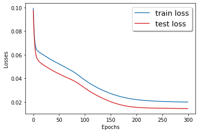

# Report Project : Predicting Trafic volume using neural networks

### Author: Ilyass Seddoug

## Data preprocessing

After importing data and taking a look at it, we can see that we have columns for years, months and day. So, it would be better if we sorted the lines by years, months then days. After that, we transform our qualitative columns into integer classes so we can use them for our neural networks. We separate our labels and features into 2 variables, X for the features and y for the labels which is the variable to predict, the traffic volume. 
As a first step, we take only a small ammount of data to speed up te computations and test our models  on this small amount. After testing our models, and if we find that we may need more data, we can add data and train our models again. After that we scale the data to bring the vaues between 0 and 1, so that the scale of the data doesn't affect the convergence of our model, since neural networks are sensitive to the scales, and larger values may take better importance if not scaled. For that we use the minmaxscaler from sklearn.
First of all, we define a function SelectDataset to create our dataset based on our feature and labels. We transform our data to Pytorch tensors, we create dataloaders for training and for testing and then we are ready to begin working on our models.

## Deep Feed-Forward Neural Network
We build a model NN, with multiple hidden layers that we train and test for 300 epochs. We choose touse multiple layers to avoid the problem of overfitting and have a better  generalization. 

```python
class NN(nn.Module):
    
    def __init__(self):
        super(NN,self).__init__()
        self.fc1 = nn.Linear(11,5)
        self.fc2 = nn.Linear(5,5)
        self.fc3 = nn.Linear(5,1)
        
    def forward(self,x):

        x = F.relu(self.fc1(x))
        x = F.relu(self.fc2(x))
        x = self.fc3(x)

        return x
```
After creating an instance of the nn.Module usning the super() function, we define our fully connected layers in the next lines:
```python
        self.fc1 = nn.Linear(11,5)
        self.fc2 = nn.Linear(5,5)
        self.fc3 = nn.Linear(5,1)  
```
A fully connected layer is represented by nn.Linear object.The first parameter being the number of nodes in the first layer, which is  for the first layer the number of features of one line of X. The second paramter is the number of nodes in the next layer, which is for the last layer, the number of labels which is one in our case, and it is the volume we want to predict.
After defining the architecture of the model, we define how data will go through our model using a forward() method. 
def forward(self,x):

```python
def forward(self,x):
        x = F.relu(self.fc1(x))
        x = F.relu(self.fc2(x))
        x = self.fc3(x)
        return x
```
First we affect to our x the result of the transformation of x after coming out of the first layer, a ReLU activation using the relu function. Then, we make our x go through the second layer and a ReLU activation. The last step is to make x go through the final layer.

Next, we are going to choose to use gpu if we have cuda and cpu instead. we create an instance of our NN model, and then we create an Adam optimizer, with the parameters of the instance of our model using the parameters() method, and the learning rate of 1e-5.
We set the loss criterion to be the Mean square error loss, which calculates the squared difference between the predicted values and the actual values.

```python
device = torch.device("cuda:0" if torch.cuda.is_available() else "cpu")
model = NN().to(device)
optimizer = torch.optim.Adam(model.parameters(), lr=1e-5)
criterion = nn.MSELoss()
```
The next step is to define a training and a testing function, to train and test our model for the number of epochs that we choose.

```python

train_losses = []
def Train():
  
    running_loss = .0
    model.train()
    
    for idx, (inputs,labels) in enumerate(train_loader):
        
        inputs = inputs.to(device)
        labels = labels.float().to(device)
        optimizer.zero_grad()
        preds = model(inputs.float())
        loss = criterion(preds,labels)
        loss.backward()
        optimizer.step()
        running_loss += loss
        
    train_loss = running_loss/len(train_loader)
    train_losses.append(train_loss.detach().cpu().numpy())
    
    print(f'train_loss {train_loss}')
```
In the training function, we first initialize our loss to zero before going through our data. We set our model mode to train and then we go through each batch of data using the train data loader. Next we set all gradients to zero, so that the model is ready to go through the next back-propagation, using the zero-grad() method. Then, we predict using our model, and then calculate the loss for this prediction. Then we run a back-propagation operation from the loss Variable backwards through the network. And before adding our loss to our final loss, we execute a gradient descent, based on the gradients calculated during the .backward() operation. Finally, we calculate the final losss by dividing the loss by the len of our data, and store our loss so we can use it for a plotting later. Then we print our loss.

After that we define the test function. It looks the same as the trainging function, but without the back propagation.

```python
test_losses = []

def Test():
    
    running_loss = .0
    model.eval()
    
    with torch.no_grad():
        for idx, (inputs, labels) in enumerate(test_loader):
            inputs = inputs.to(device)
            labels = labels.to(device)
            optimizer.zero_grad()
            preds = model(inputs.float())
            loss = criterion(preds,labels)
            running_loss += loss
            
        test_loss = running_loss/len(test_loader)
        test_losses.append(test_loss.detach().cpu().numpy())
        print(f'test_loss {test_loss}')
```
After defining those two functions, we can loop through our epochs and printthe results of each epoch with the following code:

```python
epochs = 300
for epoch in range(epochs):
    print('epochs {}/{}'.format(epoch+1,epochs))
    Train()
    Test()
```
After 300 epochs we can plot the following graphic to see the evolution of a losses for training and testing.

## Convolutional neural network

## Reccurent Neural Network

- The syntax is very simple: it's just raw texts with special formatting for titles, images, equations, etc.
- Get a look [here](https://www.markdownguide.org/cheat-sheet/) for a quick guide about the syntax
- Including an image like this:  (*attribution: XKCD.com*)
- Including a table is a bit annoying, but most good editors have plugins to easily edit markdown tables:

| Left-aligned | Center-aligned | Right-aligned |
| :---         |     :---:      |          ---: |
| git status   | git status     | git status    |
| git diff     | git diff       | git diff      |

- For a quotation with reference: "...the **go to** statement should be abolished..." [[1]](#1).

- If you want a PDF version of your report, you may convert it with pandoc:

```
   pandoc -s report.md -o report.pdf
```

or, if you use the img tag, you have to first convert into pure html:

```
pandoc -t html report.md | pandoc -f html -o report.pdf
```

## References
<a id="1">[1]</a> 
Dijkstra, E. W. (1968). 
Go to statement considered harmful. 
Communications of the ACM, 11(3), 147-148.

