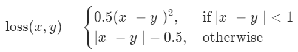
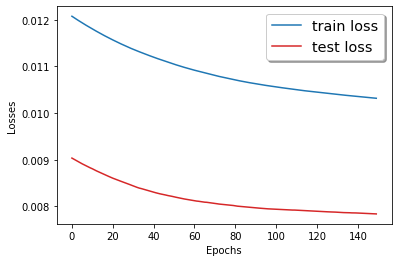
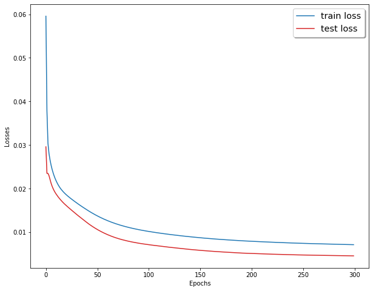
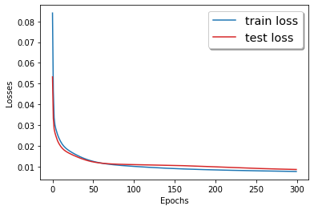

# Report Project: Predicting Traffic volume using neural networks

### Author: Ilyass Seddoug

## Introduction
Our data is composed of Traffic data collected from the several Wavetronix radar sensors deployed by the City of Austin. Dataset is augmented with geo coordinates from sensor location dataset. We will use this data and try to predict volume using different types of neural networks. This data can be considered as time series.

## Data preprocessing
After importing data and taking a look at it, we can see that we have columns for years, months and day. So, it would be better if we sorted the lines by years, months then days. After that, we transform our qualitative columns into integer classes so we can use them for our neural networks. We separate our labels and features into 2 variables, X for the features and y for the labels which is the variable to predict, the traffic volume. 
As a first step, we take only a small amount of data to speed up the computations and test our models on this small amount. After testing our models, and if we find that we may need more data, we can add data and train our models again. After that we scale the data to bring the values between 0 and 1, so that the scale of the data doesn't affect the convergence of our model, since neural networks are sensitive to the scales, and larger values may take better importance if not scaled. For that we use the minmaxscaler from sklearn.
First of all, we define a function SelectDataset to create our dataset based on our feature and labels. We transform our data to Pytorch tensors, we create dataloaders for training and for testing and then we are ready to begin working on our models.

## Deep Feed-Forward Neural Network
#### Building model
We build a model NN, with multiple hidden layers that we train and test for 300 epochs. We choose to use multiple layers to avoid the problem of overfitting and have a better generalization. 

```python
class NN(nn.Module):
    
    def __init__(self):
        super(NN,self).__init__()
        self.fc1 = nn.Linear(11,5)
        self.fc2 = nn.Linear(5,5)
        self.fc3 = nn.Linear(5,1)
        
    def forward(self,x):

        x = F.relu(self.fc1(x))
        x = F.relu(self.fc2(x))
        x = self.fc3(x)

        return x
```
After creating an instance of the nn.Module using the super() function, we define our fully connected layers in the next lines:
```python
        self.fc1 = nn.Linear(11,5)
        self.fc2 = nn.Linear(5,5)
        self.fc3 = nn.Linear(5,1)  
```
A fully connected layer is represented by nn.Linear object. The first parameter being the number of nodes in the first layer, which is for the first layer the number of features of one line of X. The second parameter is the number of nodes in the next layer, which is for the last layer, the number of labels which is one in our case, and it is the volume we want to predict.
After defining the architecture of the model, we define how data will go through our model using a forward() method. 
def forward(self,x):

```python
def forward(self,x):
        x = F.relu(self.fc1(x))
        x = F.relu(self.fc2(x))
        x = self.fc3(x)
        return x
```
First, we affect to our x the result of the transformation of x after coming out of the first layer, a ReLU activation using the relu function. Then, we make our x go through the second layer and a ReLU activation. The last step is to make x go through the final layer.

#### Training & testing the model
Next, we are going to choose to use gpu if we have cuda and cpu instead. we create an instance of our NN model, and then we create an Adam optimizer, with the parameters of the instance of our model using the parameters() method, and the learning rate of 1e-5.
We set the loss criterion to be the Mean square error loss, which calculates the squared difference between the predicted values and the actual values.

```python
device = torch.device("cuda:0" if torch.cuda.is_available() else "cpu")
model = NN().to(device)
optimizer = torch.optim.Adam(model.parameters(), lr=1e-5)
criterion = nn.MSELoss()
```
The next step is to define a training and a testing function, to train and test our model for the number of epochs that we choose.

```python

train_losses = []
def Train():
  
    running_loss = .0
    model.train()
    
    for idx, (inputs,labels) in enumerate(train_loader):
        
        inputs = inputs.to(device)
        labels = labels.float().to(device)
        optimizer.zero_grad()
        preds = model(inputs.float())
        loss = criterion(preds,labels)
        loss.backward()
        optimizer.step()
        running_loss += loss
        
    train_loss = running_loss/len(train_loader)
    train_losses.append(train_loss.detach().cpu().numpy())
    
    print(f'train_loss {train_loss}')
```
In the training function, we first initialize our loss to zero before going through our data. We set our model mode to train and then we go through each batch of data using the train data loader. Next we set all gradients to zero, so that the model is ready to go through the next back-propagation, using the zero-grad() method. Then, we predict using our model, and then calculate the loss for this prediction. Then we run a back-propagation operation from the loss Variable backwards through the network. And before adding our loss to our final loss, we execute a gradient descent, based on the gradients calculated during the backward() operation. Finally, we calculate the final loss by dividing the loss by the length of our data, and store our loss so we can use it for a plotting later. Then we print our loss.

After that we define the test function. It looks the same as the training function, but without the back propagation.

```python
test_losses = []

def Test():
    
    running_loss = .0
    model.eval()
    
    with torch.no_grad():
        for idx, (inputs, labels) in enumerate(test_loader):
            inputs = inputs.to(device)
            labels = labels.to(device)
            optimizer.zero_grad()
            preds = model(inputs.float())
            loss = criterion(preds,labels)
            running_loss += loss
            
        test_loss = running_loss/len(test_loader)
        test_losses.append(test_loss.detach().cpu().numpy())
        print(f'test_loss {test_loss}')
```
After defining those two functions, we can loop through our epochs and print the results of each epoch with the following code:

```python
epochs = 300
for epoch in range(epochs):
    print('epochs {}/{}'.format(epoch+1,epochs))
    Train()
    Test()
```


#### Results
After 300 epochs we can plot the following graphic to see the evolution of a losses for training and testing.


We can see that at 200 epochs the losses for training and for testing, reach a minimum value. But we can see that the test loss reaches a lower minimum than the training loss. This may be due to the fact that the validation set is easier to predict than the training set (by chance). Or to the fact that we have some phenomenon that is repeated in time, so the model has already seen it in the training set before encountering it in the validation set. Another possible scenario, is that the validation set is too small compared to the training set. We took a train set that is 80% of the used data and a test set that is 20% of the whole used data. So maybe we can try to take larger test sets and see if the phenomenon we encountered in here is repeated. But before that, we are going to test some other loss criterion and see if we can converge to a minimum loss before 200 epochs.

We use the Huber loss which is calculated this way:



It is less sensitive to outliers than the mean square error loss and in some cases prevents exploding gradients, because it doesn't square terms greater than one.

So we can see the following evolution of the Huber loss using our first model:


We can see that we reach a lower level of the loss before 200 epochs. However, the loss keeps going lower, if we zoom into the part between the 150's epoch and the 300's epoch, we can see that the loss gets lower with each epoch. We can say that if we give it more epochs, our model may give better performance. With 300 epochs, we reached a training loss of 0.01 and a validation loss of 0.008, which we can say that it is not bad.



So to sum up, with a deep feed forward model, we reached a low level of loss using a small amount of our data. However, at a certain level of epochs, the model learning became very slow, and the loss wasn't going lower fast enough. Now we are going to see what we can do using a convolutional neural network.

## Convolutional neural network
Convolutional neural networks exploit the correlation between the adjacent inputs to reduce the number of weights to be learned. we are going to train a convolutional neural network using the following code:

```python
class CNN(nn.Module):
    def __init__(self):
        super(CNN,self).__init__()
        self.conv1d = nn.Conv1d(1,32,kernel_size= 3, stride = 1)
        self.relu = nn.ReLU(inplace = True)
        self.maxpool = nn.MaxPool1d(3, stride=1)
        self.fc1 = nn.Linear(7 * 32,50)
        self.fc2 = nn.Linear(50,1)
        
    def forward(self,x):
        x = self.conv1d(x)
        x = self.relu(x)
        x = self.maxpool(x)
        x = x.view(10,-1)
        x = self.fc1(x)
        x = self.relu(x)
        x = F.dropout(x, training=self.training)
        x = self.fc2(x)
        
        return x
```

The first layer consists of 32 channels of convolutional filters with kernel of 3 and a stride of 1, followed by a ReLU activation and a max-pooling down sampling with kernel 3 and a stride of 1. As an input for the convolutional neural network, we've got our features that are 11, and we get an output of 9 features. Next after going through the max-pooling layer, we get an output of 7 features. This output will be fed to our fully connected layer. Since we've got 32 channels, our fully connected layer would be composed of 7 x 32 nodes because we've got an output of 7 features for the max pooling layer. And finally, we add a final fully connected layer to predict our labels.
Now that we defined our model, we should define how data flows through it using the forward function. First our input goes into the convolutional layer, then goes into a ReLU validation, and then into a max pooling layer. We then change the dimensions of our x using the view() method. This step is important to bring our data that is composed of 32 channels of 7 features into one level of 7 x 32. After that our x goes through the fully connected layer, then a ReLU validation and a dropout to reduce the overfitting. 

We use the same Train and Test function we used before; we just change the model to the CNN model. We use a Huber loss too. We use the view() method to adapt our input to the convolutional layer.

```python
model = CNN().to(device)
optimizer = torch.optim.Adam(model.parameters(), lr=1e-5)
criterion = nn.SmoothL1Loss()

train_losses = []


def Train_CNN():
    
    running_loss = .0
    
    model.train()
    
    for idx, (inputs,labels) in enumerate(train_loader):
        inputs = inputs.view(-1,1,11)
        inputs = inputs.to(device)
        labels = labels.float().to(device)
        optimizer.zero_grad()
        preds = model(inputs.float())
        loss = criterion(preds,labels)
        loss.backward()
        optimizer.step()
        running_loss += loss
        
    train_loss = running_loss/len(train_loader)
    train_losses.append(train_loss.detach().cpu().numpy())
    
    print(f'train_loss {train_loss}')

test_losses = []

def Test_CNN():
    
    running_loss = .0
    
    model.eval()
    
    with torch.no_grad():
        for idx, (inputs, labels) in enumerate(test_loader):
            inputs = inputs.view(-1,1,11)
            inputs = inputs.to(device)
            labels = labels.to(device)
            optimizer.zero_grad()
            preds = model(inputs.float())
            loss = criterion(preds,labels)
            running_loss += loss
            
        test_loss = running_loss/len(test_loader)
        test_losses.append(test_loss.detach().cpu().numpy())
        print(f'test_loss {test_loss}')
```
### Results


After 300 epochs, we get a training loss of 0.01 and a test loss 0f 0.008. It is the same loss we got using the deep feed forward neural network. However, we can see that we can converge to the minimal loss before 150 epochs. We can also see that the test set is again getting a lower loss than the training set. So maybe it would be a good idea to use a different test set and see if it acts the same.


As we can see, when we took a different validation set, we have got a training loss closer to the validation loss than the last one. So maybe this phenomenon that we get is due to the nature of the validation set that may be easier to predict than the training set.

We can try and take a bigger validation set and see if this may affect our validation loss.
Now we will try to use recurrent neural networks, because they are a good method to predict time series.

## Recurrent Neural Network
RNN are just FNN (Feedforward Neural Networks) that have a hidden layer that makes information flows from one FNN to the other. It allows time dependency between FNNs. So, in our RNN, we are going to use 2 time sequences. For each time sequence, we are going to introduce one X, which is 11 features. So, we are going to need to change the size of our input data, for that we create a dataset that for each line, takes 2 lines of our X.

```python
X_train, X_test = X_train.view(-1, 2, 11), X_test.view(-1, 2, 11)
y_train, y_test = y_train.view(-1, 2), y_test.view(-1, 2)

batch_size = 10
test = SelectDataset(X_test,y_test)
train = SelectDataset(X_train, y_train)
train_loader = DataLoader(train, batch_size = batch_size,shuffle = False)
test_loader = DataLoader(test, batch_size = batch_size, shuffle = False)
```
After we have done this, we’re going to build our RNN:

```python
class RNN(nn.Module):
    def __init__(self, input_dim, hidden_dim, layer_dim, output_dim):
        
        super(RNN, self).__init__()
        self.hidden_dim = hidden_dim 
        self.layer_dim = layer_dim  
        self.rnn = nn.RNN(input_dim, hidden_dim, layer_dim, batch_first=True, nonlinearity='relu')
        self.fc = nn.Linear(hidden_dim, output_dim)

    def forward(self, x):

        h0 = torch.zeros(self.layer_dim, x.size(0), self.hidden_dim).requires_grad_().cuda()
        x, hn = self.rnn(x, h0.detach())
        x = self.fc(x[:, -1, :]) 

        return x
``` 
The first step is to create an instance of the nn.Modue as we have done for the previous models. After that we define the variables hidden_dim which represents the dimension of the hidden layer, and layer_dim which represents the number of hidden layers. Then we define the RNN model using the nn.RNN model and all the parameters that it takes, for instance the input dimension which represents the dimension of our input which is going to be 11 in our case. Next we define our FNN using the nn.Linear object. 
Our model is defined now, we have to define the way data will flow through it using the forward function. First of all, we initialize our hidden states with zeros and put it on gpu because we are going to use gpu after that. Then we make our x go through our RNN, and at the end, we take only the last time step of the RNN and introduce it into the FNN.
We define training and testing functions like we did for our other models. There are no changes in those functions, we just define the model parameters and then define the model and make it run for 300 epochs.

```python
input_dim = 11
hidden_dim = 100
layer_dim = 1
output_dim = 2

model_RNN = RNN(input_dim, hidden_dim, layer_dim, output_dim).to(device)
optimizer = torch.optim.Adam(model_RNN.parameters(), lr=1e-5)
criterion = nn.SmoothL1Loss()

train_losses_RNN = []

def Train_RNN():
    
    running_loss = .0
    
    model_RNN.train()
    
    for idx, (inputs,labels) in enumerate(train_loader):
        inputs = inputs.to(device)
        labels = labels.float().to(device)
        optimizer.zero_grad()
        preds = model_RNN(inputs.float())
        loss = criterion(preds,labels)
        loss.backward()
        optimizer.step()
        running_loss += loss
        
    train_loss = running_loss/len(train_loader)
    train_losses_RNN.append(train_loss.detach().cpu().numpy())
    
    print(f'train_loss {train_loss}')

test_losses_RNN = []

def Test_RNN():
    
    running_loss = .0
    
    model_RNN.eval()
    
    with torch.no_grad():
        for idx, (inputs, labels) in enumerate(test_loader):
            inputs = inputs.to(device)
            labels = labels.to(device)
            optimizer.zero_grad()
            preds = model_RNN(inputs.float())
            loss = criterion(preds,labels)
            running_loss += loss
            
        test_loss = running_loss/len(test_loader)
        test_losses_RNN.append(test_loss.detach().cpu().numpy())
        print(f'test_loss {test_loss}')


epochs = 300
for epoch in range(epochs):
    print('epochs {}/{}'.format(epoch+1,epochs))
    Train_RNN()
    Test_RNN()
```

### Results
When running the RNN, we could see that the running time is faster than all the other models, and after 300 epochs we've got losses that were lower than the other models. 



We can see again that the test loss is lower than the training loss, but when using another slice for validation, we can see that it is just due to the nature of the validation test and not to the model itself:



We can reach a loss of 0.008 for the test and the training losses, which is better than the other models. It is maybe due to the relationship in time between our lines. There should be a link between the data in time, and this link is making the RNN performing better than other models.

## Conclusion
So, our data was composed of information concerning Radar Traffic, and we tried to predict traffic volume using neural networks.  We tried different types of neural networks: (Deep Feedforward, Convolutional and Recurrent), and 2 types of losses: (The Mean Squared Error and the Huber loss). We could see that we got nearly the same results for the Deep Feedforward and the convolutional neural networks, but the convolutional neural networks used less epochs with the same amount of data. The RNNs gave us better results, and took much less computing time. We could also see that for several times, we have got a testing loss that was lower than the training loss. This is maybe due to the nature of the train and the validation sets we have chosen, because when we changed the test set, we have got different behavior. So, to sum up, it may be interesting to use the models with bigger datasets than the ones we have used and this will surely give us better models that generate better, and we can also have datasets that represent better the information we are trying to extract from the data.  

## References
[1]https://medium.com/udacity-pytorch-challengers/a-brief-overview-of-loss-functions-in-pytorch-c0ddb78068f7   
[2]https://adventuresinmachinelearning.com/pytorch-tutorial-deep-learning/   
[3]https://adventuresinmachinelearning.com/convolutional-neural-networks-tutorial-in-pytorch/   
[4]https://www.deeplearningwizard.com/deep_learning/practical_pytorch/pytorch_recurrent_neuralnetwork/   
[5]https://www.kaggle.com/vinayshanbhag/radar-traffic-data  


