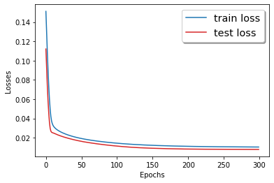

# Report Project : Predicting Trafic volume using neural networks

### Author: Ilyass Seddoug

## Data preprocessing

After importing data and taking a look at it, we can see that we have columns for years, months and day. So, it would be better if we sorted the lines by years, months then days. After that, we transform our qualitative columns into integer classes so we can use them for our neural networks. We separate our labels and features into 2 variables, X for the features and y for the labels which is the variable to predict, the traffic volume. 
As a first step, we take only a small ammount of data to speed up te computations and test our models  on this small amount. After testing our models, and if we find that we may need more data, we can add data and train our models again. After that we scale the data to bring the vaues between 0 and 1, so that the scale of the data doesn't affect the convergence of our model, since neural networks are sensitive to the scales, and larger values may take better importance if not scaled. For that we use the minmaxscaler from sklearn.
First of all, we define a function SelectDataset to create our dataset based on our feature and labels. We transform our data to Pytorch tensors, we create dataloaders for training and for testing and then we are ready to begin working on our models.

## Deep Feed-Forward Neural Network
#### Building model
We build a model NN, with multiple hidden layers that we train and test for 300 epochs. We choose touse multiple layers to avoid the problem of overfitting and have a better  generalization. 

```python
class NN(nn.Module):
    
    def __init__(self):
        super(NN,self).__init__()
        self.fc1 = nn.Linear(11,5)
        self.fc2 = nn.Linear(5,5)
        self.fc3 = nn.Linear(5,1)
        
    def forward(self,x):

        x = F.relu(self.fc1(x))
        x = F.relu(self.fc2(x))
        x = self.fc3(x)

        return x
```
After creating an instance of the nn.Module usning the super() function, we define our fully connected layers in the next lines:
```python
        self.fc1 = nn.Linear(11,5)
        self.fc2 = nn.Linear(5,5)
        self.fc3 = nn.Linear(5,1)  
```
A fully connected layer is represented by nn.Linear object.The first parameter being the number of nodes in the first layer, which is  for the first layer the number of features of one line of X. The second paramter is the number of nodes in the next layer, which is for the last layer, the number of labels which is one in our case, and it is the volume we want to predict.
After defining the architecture of the model, we define how data will go through our model using a forward() method. 
def forward(self,x):

```python
def forward(self,x):
        x = F.relu(self.fc1(x))
        x = F.relu(self.fc2(x))
        x = self.fc3(x)
        return x
```
First we affect to our x the result of the transformation of x after coming out of the first layer, a ReLU activation using the relu function. Then, we make our x go through the second layer and a ReLU activation. The last step is to make x go through the final layer.

#### Training & testing the model
Next, we are going to choose to use gpu if we have cuda and cpu instead. we create an instance of our NN model, and then we create an Adam optimizer, with the parameters of the instance of our model using the parameters() method, and the learning rate of 1e-5.
We set the loss criterion to be the Mean square error loss, which calculates the squared difference between the predicted values and the actual values.

```python
device = torch.device("cuda:0" if torch.cuda.is_available() else "cpu")
model = NN().to(device)
optimizer = torch.optim.Adam(model.parameters(), lr=1e-5)
criterion = nn.MSELoss()
```
The next step is to define a training and a testing function, to train and test our model for the number of epochs that we choose.

```python

train_losses = []
def Train():
  
    running_loss = .0
    model.train()
    
    for idx, (inputs,labels) in enumerate(train_loader):
        
        inputs = inputs.to(device)
        labels = labels.float().to(device)
        optimizer.zero_grad()
        preds = model(inputs.float())
        loss = criterion(preds,labels)
        loss.backward()
        optimizer.step()
        running_loss += loss
        
    train_loss = running_loss/len(train_loader)
    train_losses.append(train_loss.detach().cpu().numpy())
    
    print(f'train_loss {train_loss}')
```
In the training function, we first initialize our loss to zero before going through our data. We set our model mode to train and then we go through each batch of data using the train data loader. Next we set all gradients to zero, so that the model is ready to go through the next back-propagation, using the zero-grad() method. Then, we predict using our model, and then calculate the loss for this prediction. Then we run a back-propagation operation from the loss Variable backwards through the network. And before adding our loss to our final loss, we execute a gradient descent, based on the gradients calculated during the .backward() operation. Finally, we calculate the final losss by dividing the loss by the len of our data, and store our loss so we can use it for a plotting later. Then we print our loss.

After that we define the test function. It looks the same as the trainging function, but without the back propagation.

```python
test_losses = []

def Test():
    
    running_loss = .0
    model.eval()
    
    with torch.no_grad():
        for idx, (inputs, labels) in enumerate(test_loader):
            inputs = inputs.to(device)
            labels = labels.to(device)
            optimizer.zero_grad()
            preds = model(inputs.float())
            loss = criterion(preds,labels)
            running_loss += loss
            
        test_loss = running_loss/len(test_loader)
        test_losses.append(test_loss.detach().cpu().numpy())
        print(f'test_loss {test_loss}')
```
After defining those two functions, we can loop through our epochs and printthe results of each epoch with the following code:

```python
epochs = 300
for epoch in range(epochs):
    print('epochs {}/{}'.format(epoch+1,epochs))
    Train()
    Test()
```


#### Results
After 300 epochs we can plot the following graphic to see the evolution of a losses for training and testing.


We can see that at 200 epochs the losses for training and for testing, reach a  minimum value. But we can see that the test loss reaches a lower minimum than the training loss. This may be due to the fact that the validation set is easier to predict than the training set (by chance). Or to the fact that we have some phenomenon that is repeated in time, so the model has already seen it in the training set before encountering it in the validation set. Another possible scenario, is that the validation set is too small compared to the training set. We took a train set that is 80% of the used data and a test set that is 20% of the whole used data. So maybe we can try to take larger test sets and see if the phenomenon we encountered in here is repeated. But before that, we are going to test some other loss criterion and see if we  can converge to a minimum loss before 200 epochs.

We use the huber loss which is calculated this way:


It is less sensitive to outliers than the mean square error loss and in some cases prevents exploding gradients, because it doesn't square terms greater than one.

So we can see the following evolution of the huber loss using our first model:



We can see that we reach a lower level of the loss before 200 epochs. However the loss keeps going lower, if we zoom into the part between the 150's epoch and the 300's epoch, we can see that the loss gets lower with each epoch. We can say that if we give it more epochs, our model may give better performance. With 300 epochs, we reached a training loss of 0.01 and a validation loss of 0.008, which we can say that it is not bad.


So to sum up, with a deep feed forward model, we reached a low level of loss using a small amount of our data. However, at a certain level of epochs, the model learning became very slow, and the loss wasn't going lower fast enough. Now we are going to see what we can do using a convolutional neural network.

## Convolutional neural network
Convolutional neural networks exploit the correlation between the adjacent inputs to reduce the number of wheights to be learned. we are going to train a convolutional neural network using the following code:

```python
class CNN(nn.Module):
    def __init__(self):
        super(CNN,self).__init__()
        self.conv1d = nn.Conv1d(1,32,kernel_size= 3, stride = 1)
        self.relu = nn.ReLU(inplace = True)
        self.maxpool = nn.MaxPool1d(3, stride=1)
        self.fc1 = nn.Linear(7 * 32,50)
        self.fc2 = nn.Linear(50,1)
        
    def forward(self,x):
        x = self.conv1d(x)
        x = self.relu(x)
        x = self.maxpool(x)
        x = x.view(10,-1)
        x = self.fc1(x)
        x = self.relu(x)
        x = F.dropout(x, training=self.training)
        x = self.fc2(x)
        
        return x
```

The first layer consists of 32 channels of convolutional filters with kernel of 3 and a stride of 1, followed by a ReLU activation and a max-pooling downsampling iwth kernel 3 and a stride of 1. As an input for the convolutional neural network, we've got our features that are 11, and we getan output of 9 features. Next after going through the max-pooling layer, we get an output of 7 features. This output will be feeded to our fully connected layer. Since we've got 32 channels, our fully connected layer would be composed of 7*32 nodes because we've got an output of 7 features for the maxpooling layer. And finally, we add a final fully connected layer to predict our labels.
Now that we defined our model, we should define how data flows through it using the forward function. First our input goes into the convolutional layer, then goes into a ReLU validation, and then into a maxpooling layer. We then change the dimensions of our x using the view() method. This step is important to bring our data that is composed of 32 channels of 7 features into one level of 7*32. After that our x goes through the fully connected layer, then a ReLU validation and a dropout to reduce the overfitting. 

We use the same Train and Test function we used before, we just change the model to the CNN model. We use a Huber loss too. We use the view() method to adapt our input to the convolutional layer.

```python
model = CNN().to(device)
optimizer = torch.optim.Adam(model.parameters(), lr=1e-5)
criterion = nn.SmoothL1Loss()

train_losses = []


def Train_CNN():
    
    running_loss = .0
    
    model.train()
    
    for idx, (inputs,labels) in enumerate(train_loader):
        inputs = inputs.view(-1,1,11)
        inputs = inputs.to(device)
        labels = labels.float().to(device)
        optimizer.zero_grad()
        preds = model(inputs.float())
        loss = criterion(preds,labels)
        loss.backward()
        optimizer.step()
        running_loss += loss
        
    train_loss = running_loss/len(train_loader)
    train_losses.append(train_loss.detach().cpu().numpy())
    
    print(f'train_loss {train_loss}')

test_losses = []

def Test_CNN():
    
    running_loss = .0
    
    model.eval()
    
    with torch.no_grad():
        for idx, (inputs, labels) in enumerate(test_loader):
            inputs = inputs.view(-1,1,11)
            inputs = inputs.to(device)
            labels = labels.to(device)
            optimizer.zero_grad()
            preds = model(inputs.float())
            loss = criterion(preds,labels)
            running_loss += loss
            
        test_loss = running_loss/len(test_loader)
        test_losses.append(test_loss.detach().cpu().numpy())
        print(f'test_loss {test_loss}')
```
### Results
After 300 epochs, we get a training loss of 0.01 and a test loss 0f 0.008. It is the same loss we got using the 
## Reccurent Neural Network


## References
<a id="1">[1]</a> 
https://medium.com/udacity-pytorch-challengers/a-brief-overview-of-loss-functions-in-pytorch-c0ddb78068f7
https://adventuresinmachinelearning.com/pytorch-tutorial-deep-learning/
https://adventuresinmachinelearning.com/convolutional-neural-networks-tutorial-in-pytorch/


